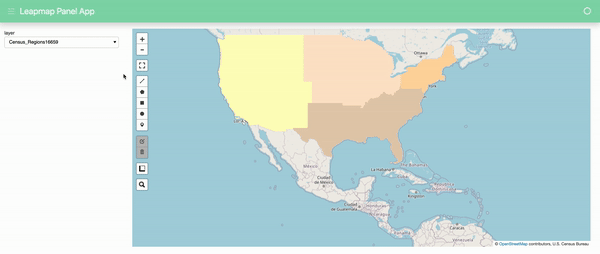

# Leafmap Panel App

This is a very basic example using Leapmap in a Panel App. 



### Basic

```bash
conda install -c conda-forge hvplot panel pandas jupyterlab leafmap
```

### Run notebook locally

To run the notebook

```bash
panel serve panel_leafmap.ipynb
```

